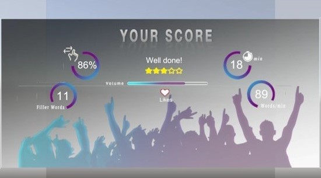

# VR_Debate

## Inspiration
While chilling with my friends, we were debating about the classic marvel vs dc and then it struck to us, why not let other fans join our debate, "virtually" to the same debate, and thus came the idea for Virtual Reality Debate.

## What it does
This is a Google Cardboard compatible VR App which lets users join debate rooms of their choice and express their ideas with others, it even lets users witness other debates as audience.
The app also provides a space to practice one's speaking skills and also helps overcome the fear of public speaking by simulating a live audience.
The app consists of three modes right now
1) Debate mode -
In this mode, the user connects to a debate room on a podium along with a fellow debater. This room can be joined by the spectators in real-time to witness the debate.
2) Spectator mode -
The user can attend the ongoing debates or conversations and be a silent spectator for the same.
3) Practice Mode -
In this mode, you will be put in front of a live class so that you can practice your speaking skills and develop that confidence and skill.
The overall objective of this project is to provide a virtual reality environment which is easily accessible by anyone and it offers a way to effectively improve your speaking skills. We also integrated this app with a Google speech to text API which will inform you about your talking speed and will give you feedback on how frequently you use emphatic words.
## How we built it
So we started building the project on Unity on a Light Weight Render Pipeline to involve better graphics for the app. We first made the main screen with three options to choose from-Debate, Spectate, Practice. We built custom shaders for these options and added post-processing to them. We added GoogleVR Unit package to the project and made the necessary changes. On testing, we found out that there was a bug with LWRP and GVR when used together so we had to scrape that part and start over in a normal 3d environment.
After finalizing the UI part, we moved on to the next major milestone, that is, adding realtime voice communication from the Vr app. To do so we used the Agora Voice SDK. After going through the documentation we added the SDK to Unity and tested it out on 2 mobile devices. No bugs were found and we moved on to the multiplayer part of the app. We had 2 options, UNet framework which would host our app on Unity Servers, or building our server. Since we were keen to learn new stuff we decided to do the latter. The server used sockets as a major part of the communication.Sockets.io package was also added to Unity. We made custom events for the same and deployed the server on our device. We faced some issue while syncing the server with the application and it did take a while to resolve them. Final changes to UI were made and the app was then tested on Google Cardboard.
## Screenshots
Dashboard: 

Debate: 

Practice: 

Speech Score: 

